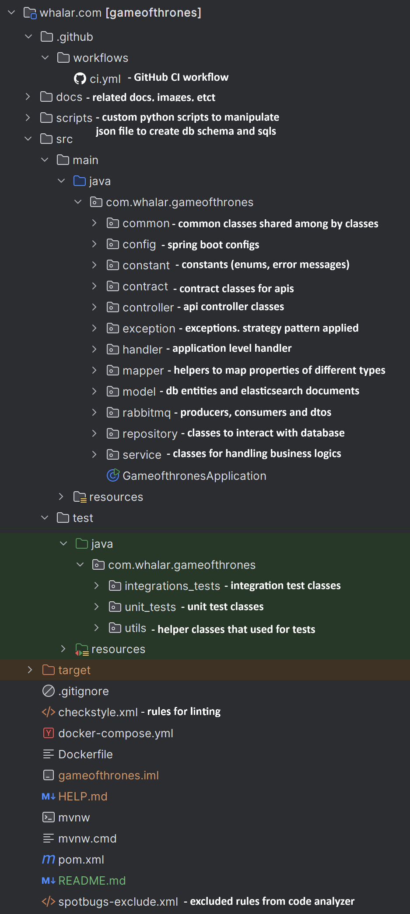

<a name="readme-top"></a>

<!-- BADGE LOGO -->
<div align="center">
    
    
    
    
    
    
    
</div>


<!-- PROJECT LOGO -->
<br />
<div align="center">
  <a href="https://github.com/abbcyhn/got-web-app">
    
  </a>

<h3 align="center">REST API that allows to save and query Game Of Thrones character</h3>
</div>

<!-- TABLE OF CONTENTS -->
<summary>Table of Contents</summary>
<ol>
  <li>
    <a href="#about-the-project">About The Project</a>
    <ul>
      <li><a href="#system-architecture">System Architecture</a></li>
      <li><a href="#database-design">Database Design</a></li>
      <li><a href="#openapi-documentation">OpenAPI Documentation</a></li>
      <li><a href="#asyncapi-doc">AsyncAPI Documentation</a></li>
      <li><a href="#project-structure">Project Structure</a></li>
      <li><a href="#tools-technologies">Tools & Technologies</a></li>
    </ul>
  </li>
  <li>
    <a href="#getting-started">Getting Started</a>
    <ul>
      <li><a href="#prerequisites">Prerequisites</a></li>
      <li><a href="#installation">Installation</a></li>
    </ul>
  </li>
  <li><a href="#contact">Contact</a></li>
</ol>


<!-- ABOUT THE PROJECT -->
## About The Project

### System Architecture

The CRUD and SEARCH services are developed as monolith for sake of simplicty. However, they must be broken into microservices in production as mentioned in high-level design:

![System Design][system-design]

### Database Design

It is assumed that for (characterId, actionTo, actionType) pair there will be no swap version of that when data inserted to "actions" table in order to avoid duplication. This can be prevented by backend validations or database trigger. For sake of simplicity this part is skipped. The logic is the same for:
* (characterId, relationshipTo, relationshipType) pair in "relationships"
* (characterId, allyId) pair in "allies" tables

Examples queries:

* To find out Tywin Lannister (id = 4) killed who we can use following query:
  ```sql
  select characterId from relationships where characterId = 4 and relationType = KILLED
  ```

* To find out who killed Tywin Lannister (id = 4) we can use following query:
  ```sql
  select characterId from relationships where relationTo = 4 and relationType = KILLED
  ```


You can interract with database from here https://dbdocs.io/abbcyhn/game-of-thrones-characters-dbdocs?view=relationships

![Database Design][database-design]

### OpenAPI Documentation

OpenAPI documentation. Url is http://localhost:8080/swagger-ui/index.html

![OpenAPI Documentation][openapi-doc]

### AsyncAPI Documentation

AsyncAPI documentation. after running url is http://localhost:8080/springwolf/asyncapi-ui.html

![AsyncAPI Documentation][asyncapi-doc]

### Tools & Technologies
- [x] Java, Spring Boot, PostgreSQL
- [x] [RESTful APIS](/src/main/java/com/whalar/gameofthrones/controller)
  - [x] OpenAPI documentation. Url is http://localhost:8080/swagger-ui/index.html
- [x] Elasticsearch [is connected and working](/src/main/java/com/whalar/gameofthrones/model/CharacterDocument.java)
- [x] RabbitMq is [connected and working](/src/main/java/com/whalar/gameofthrones/rabbitmq)
  - [x] AsyncAPI documentation. url is http://localhost:8080/springwolf/asyncapi-ui.html
- [x] [Dockerfile](Dockerfile) and [docker-compose.yml](docker-compose.yml) is created
- [x] [Github CI](.github/workflows/ci.yml) is [connected and working](https://github.com/abbcyhn/got-web-app/actions/)
  * runs both unit and integrations test when code is pushed
  * generates code coverage report and upload as artifact
  * if code coverage report is below 75% gives error. example: https://github.com/abbcyhn/got-web-app/actions/runs/9826943078/job/27129039229
- [x] [Implement unit tests for the API](/src/test/java/com/whalar/gameofthrones/unit_tests)
- [x] [Implement integration tests](/src/test/java/com/whalar/gameofthrones/integrations_tests)
  * for integreation tests [testcontainers](https://testcontainers.com/) is used for postgres, rabbitmq, and elastic search.
  * BDD style approach is followed
  * [faker](https://github.com/DiUS/java-faker) and [easyrandom](https://github.com/j-easy/easy-random) is used for generating random and fake datas
- [x] [Jacoco](https://www.jacoco.org/) for [Code coverage reports](https://github.com/abbcyhn/got-web-app/actions/runs/9827328623/artifacts/1675017849)
- [x] [SpotBugs](https://spotbugs.github.io/) for [Code analysis report](https://github.com/abbcyhn/got-web-app/actions/runs/9827328623/artifacts/1675017850)
- [x] [Checkstyle](https://checkstyle.sourceforge.io/) for linting
- [x] Custom [python scripts](scripts) is written for creating insert sqls from give [got-characters.json](scripts/got-characters.json) and upload them to database


### Project Structure

You can find short explanation for each folder in source code from here:



<!-- GETTING STARTED -->
## Getting Started
To set up the project locally, you can follow the these instructions.

Note: After running application you can find:
* OpenAPI documentation in http://localhost:8080/swagger-ui/index.html
* AsyncAPI documentation in http://localhost:8080/springwolf/asyncapi-ui.html
* /db-filler endpoint which fills database with data and syncs with elastic search. So you can test api smoothly.

### Installation
You just need to clone the project using following command:
```sh
git clone https://github.com/abbcyhn/got-web-app
```

### Run on Docker

Follow these steps to run the project on docker:

1. Move to project directory
   ```sh
   cd got-web-app
   ```

2. Run docker compose command

    * On Windows
      ```sh
      docker-compose up -d
      ```

    * On Linux
      ```sh
      docker compose up -d
      ```

### Run on Locally
Follow these steps to run the project locally:
1. Move to project directory
   ```sh
   cd got-web-app
   ```

2. Install maven dependencies
   ```sh
   mvn clean install
   ```

3. Run the project
   ```sh
    mvn spring-boot:run
   ```

<p align="right">(<a href="#readme-top">back to top</a>)</p>


<!-- CONTACT -->
## Contact

My Email - jeyhun@abbasov.dev

Project Link: [https://github.com/abbcyhn/got-web-app](https://github.com/abbcyhn/got-web-app)

<p align="right">(<a href="#readme-top">back to top</a>)</p>


<!-- MARKDOWN LINKS & IMAGES -->
[system-design]: docs/systemdesign.png
[database-design]: docs/dbdesign.png
[openapi-doc]: docs/openapi.png
[asyncapi-doc]: docs/asyncapi.png
[project-structure]: docs/projectstructure.png
